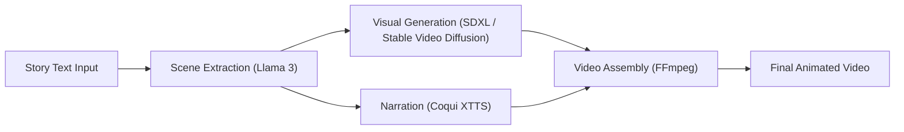

---

# 🎬 StoryTails – AI Text-to-Video Story Generator

StoryTails is an **AI-powered storytelling system** that transforms written stories into fully animated videos. It understands narrative flow, generates visual scenes, and adds synchronized voice narration to bring stories to life.

Using **LLM-based scene extraction (Llama 3)**, **diffusion-driven visual generation (SDXL, Stable Video Diffusion)**, and **neural speech synthesis (Coqui XTTS)**—all seamlessly assembled via **FFmpeg**—StoryTails automates the complete animation process.

---

## 🚀 Key Features

* 🎥 Converts **text stories into animated videos**
* 🧠 **Llama 3** for scene extraction and narrative understanding
* 🖼 **SDXL & Stable Video Diffusion** for high-quality visual generation
* 🎙 **Coqui XTTS** for multilingual AI voice narration
* 🎬 **FFmpeg** for synchronized audio–video assembly
* 💻 **Streamlit UI** for interactive story input and preview
* 🔁 Maintains visual consistency across frames
* ⚙️ Optimized prompt flow for coherent storytelling

---

## 🧠 AI Workflow



---

## 🛠 Tech Stack

| Component              | Technology                   |
| ---------------------- | ---------------------------- |
| Scene Extraction       | Llama 3                      |
| Image/Video Generation | SDXL, Stable Video Diffusion |
| Voice Generation       | Coqui XTTS                   |
| Synchronization        | FFmpeg                       |
| Interface              | Streamlit                    |
| Language               | Python                       |

---

## 📂 Project Structure

```
StoryTails/
├── main.py                  # Streamlit interface or pipeline starter
├── director.py              # Scene extraction & script logic
├── narrator.py              # Speech synthesis (XTTS)
├── final_editor.py          # FFmpeg-based video composition
├── project_be.py            # Backend flow management
├── temp_scenes/             # Intermediate scene data
├── output/                  # Final generated videos (ignored via .gitignore)
├── .gitignore
└── README.md
```

---

## 📦 Installation

```bash
git clone https://github.com/JayeshMahajan8055/StoryTails-AI-.git
cd StoryTails-AI-
python -m venv venv
venv\Scripts\activate      # Windows
# source venv/bin/activate # Mac/Linux
pip install -r requirements.txt
```

---

## 🔐 Environment Setup

Create a `.env` file:

```ini
OPENAI_API_KEY=your_openai_key
COQUI_API_KEY=your_coqui_key
```

⚠ Ensure these keys are **not pushed to GitHub**.

---

## ▶️ Usage

### Run via Streamlit UI

```bash
streamlit run main.py
```

### Or run the full pipeline directly:

```bash
python main.py
```

Then:

📝 Write your story → 📸 Scenes generated → 🎙 Narration added → 🎞 Final video rendered.

---

## 🧪 Example Story Input

```
Once upon a time in a futuristic city, a young girl named Aira discovered 
a glowing AI cube that spoke in an ancient language...
```

**Output:**

📌 LLM extracts scenes → 🎨 AI generates visuals → 🔊 XTTS narrates → 🎬 Final animated video assembled.

---

## 🚨 Limitations

🔸 Requires GPU acceleration for image/video generation
🔸 Character consistency may vary
🔸 Takes time for longer inputs
🔸 TTS synchronization may need fine tuning

---

## 🔮 Future Improvements

* Real-time video preview
* Character appearance memory
* Support for branching storylines
* Web deployment (HuggingFace/GPU Cloud)
* Automatic subtitle generation

---

## 🤝 Contribution

Contributions are welcome!

1. Fork this repo
2. Create a feature branch (`feature/my-feature`)
3. Commit improvements
4. Open a Pull Request 🚀

---

## 📬 Contact

**Jayesh Mahajan**
AI/ML Engineer | Generative AI | Multimodal Systems
📍 Pune, India
🔗 GitHub: [JayeshMahajan8055](https://github.com/JayeshMahajan8055)
💼 LinkedIn: *Add your LinkedIn profile link here*
📧 Email: *Add your email here*

---

## ⭐ Support

If you found this project interesting, please **star ⭐ the repository** to support development.

---

> *“Storytelling is humanity’s oldest art — StoryTails brings it to life with AI.”* 🚀

---

 
